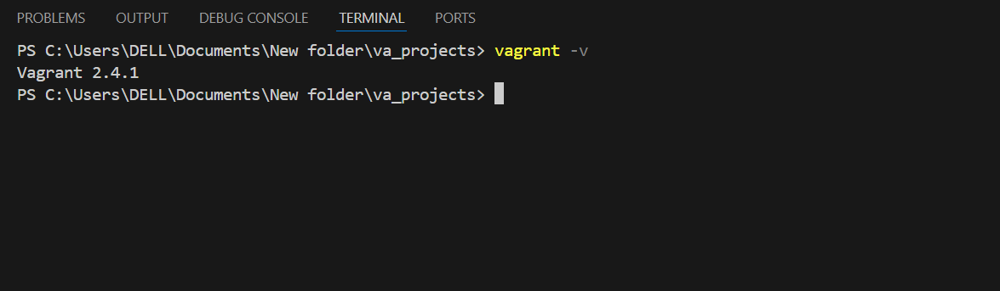
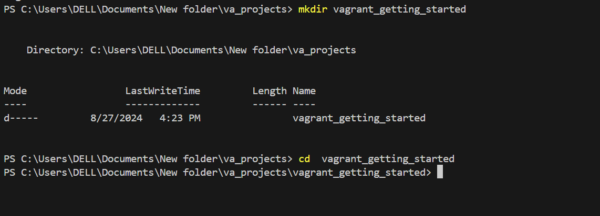
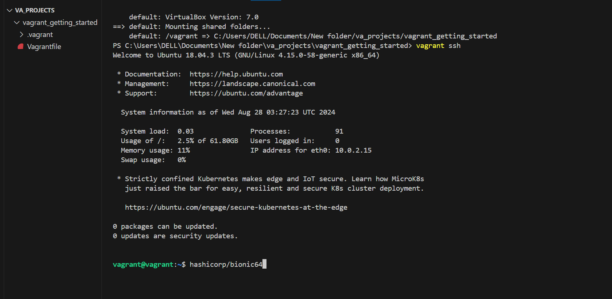
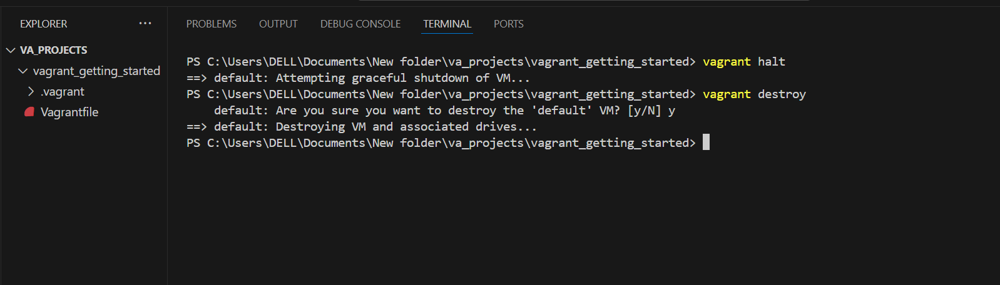

# Installation and configuration of Vagrant

 The screen shot below shows vagrant have been installed on my machine. 
 
 

 

  The screen shot below shows how i navigated to the  folder I created for the execution of vagrant commands 
  
 

  I was able to deploy the vitual machine executing vagarnt up and vagrant ssh .See below 
 

I executed vagrant halt and vagrant destroy to terminate and destroy the virtual machine 
 
